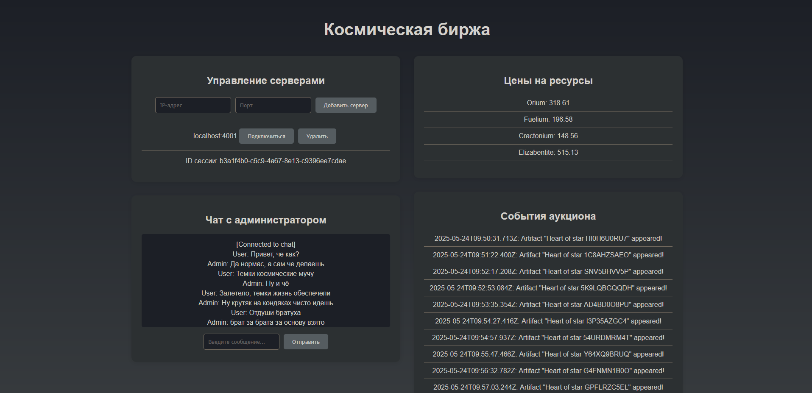
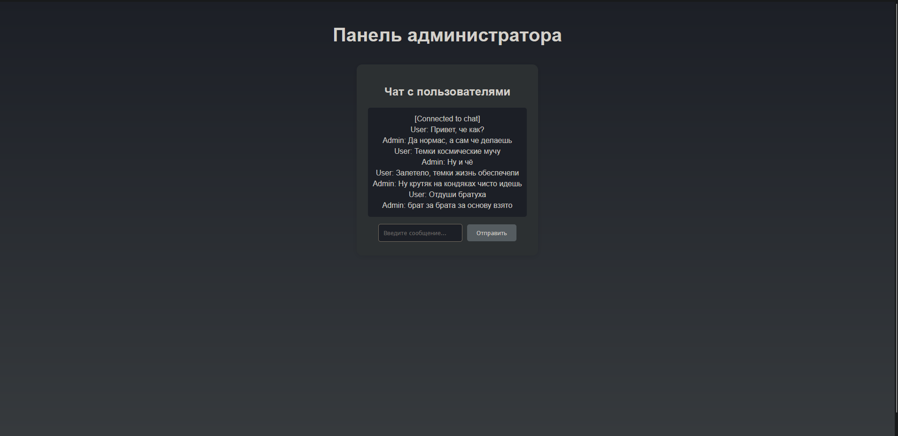

# Описание проекта

Веб-приложение состоит из трёх частей: **Клиент**, **Админ-панель** и **Сервер**.

### Клиент (`client/src/App.js`)

- **TCP-эмуляция** (`ws://localhost:4001`): регистрация "кораблей" (сессий), выдача `sessionId`.
- **UDP-эмуляция** (`ws://localhost:4002`): потоковые данные о ценах на ресурсы (обновление каждую секунду).
- **Аукционные события** (`ws://localhost:4003`): получение событий аукциона (например, появление артефактов).
- **Чат** (`ws://localhost:4004`): общение с администратором.

### Админ-панель (`admin/src/App.js`)

- **Чат** (`ws://localhost:4004`): админ подключается к общему чату, может отправлять и получать сообщения.

### Сервер (`server/server.js`)

- Обеспечивает клиентские странички нужной информацией и соеденениями.

| Порт  | Назначение                                 |
|-------|--------------------------------------------|
| 4001  | TCP-эмуляция (сессии)                      |
| 4002  | UDP-эмуляция (цены)                        |
| 4003  | Аукционные события                         |
| 4004  | Чат (общий для клиентов и админа)          |

---

## Примеры работы




---

## Инструкция по запуску проекта

Для работы требуется установленный Node.js.

### 1. Сервер (Backend)

```bash
cd server
npm install ws
node server
```

### 2. Клиент (Client)

```bash
cd client
npm install
npm start
```

### 3. Админ-панель (Admin)

```bash
cd admin
npm install
npm start
```
